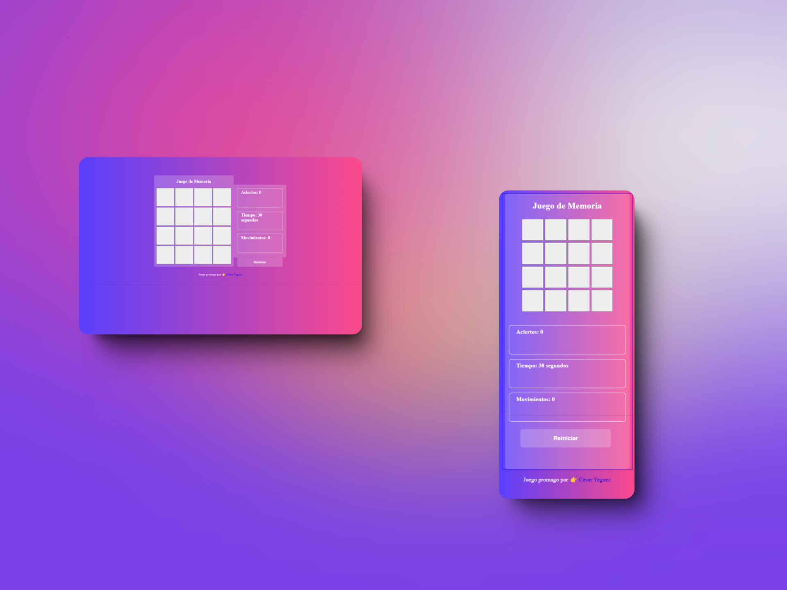

# Juego de Memoria 

t a darle click a la segunda carta este cuenta el número de jugadas, si las cartas tocadas son iguales se quedaran destapadas y se sumara un acierto, si no logras encontrar los pares de  cartas en los 30 segundos se bloquearan y se volteran todas las cartas mostrandote la ubicación de los pares.

Este proyecto es responsivo, tiene un modo mobile y un desktop.

## Documentation

[Documentation](https://developer.mozilla.org/es/docs/Learn/HTML/Introduction_to_HTML/Document_and_website_structure)

## Screenshots

## Authors

- [@cyeguez](https://github.com/cyeguez)

## 🚀 About Me
Hi 👋, I'm César Yeguez
Frontend Developer
💬 Ask me about **HTM, CSS, JavaScript

📫 How to reach me **cesar.yeguez@gmail.com

👨‍💻 All of my projects are available at **https://github.com/cyeguez?tab=repositories

  
Connect with me:
*cesar.yeguez@gmail.com

Languages and Tools:
Javascript HTML Css Sass Bootstrap Adobe Illustrator Figma Photoshop

